title: Service Worker
author:
  name: Adrien Gibrat
  url: rocket.oodrive.net/channel/frontend
  email: a.gibrat@oodrive.com
theme: ./theme
controls: false
output: index.html

--

# Service Worker
## A [gentle] introduction

--

## What is a worker ?

--

### JS used to run everything in main thread


<script>
// Hide X and lines
document.currentScript.parentNode.addEventListener('mermaid', event => {
	event.target.querySelectorAll('g:nth-child(4), line')
		.forEach(e => e.style = 'visibility: hidden !important')
})
</script>

[🏋 Intensive Javascript](https://developer.mozilla.org/en-US/docs/Tools/Performance/Scenarios/Intensive_JavaScript)

--

### Workers runs JS in another thread

```mermaid
sequenceDiagram
	participant B as 🗔 Browser
	participant W as 📃 Worker
	B->>W: register
```



[📓 Worker API](https://developer.mozilla.org/en-US/docs/Web/API/Worker)

--

### Uses events to communicate

```mermaid
sequenceDiagram
	participant B as 🗔 Browser
	participant W as 📃 Worker
	B->>W: register
	loop events
		W--xB: message
		B--xW: 
	end
```



[📯 postMessage](https://developer.mozilla.org/en-US/docs/Web/API/Worker/postMessage)

--

### Three kind of (very different) Workers

> Running background scripts independently of any UI

- Web Workers <small class="fragment">since 2010, useful to perform heavy computation, ex: pdfjs</small>
- Shared Workers <small class="fragment">since 2010, ~~removed from webkit in 2015~~</small>
- Service Workers <small class="fragment">since 2014, foundation of Progressive Web Application</small>

[👷 Workers](https://www.w3.org/TR/workers/)

--

## Let's talk about Service workers

--

### Offline & 'Off browser'

> A service worker acts as proxy between your web application, the browser and the network

- Offline access
- Push notifications
- and more

[📖 Service Worker API](https://developer.mozilla.org/en-US/docs/Web/API/Service_Worker_API)

--

### Uses recent async APIs

support: chrome, mozilla, android, opera, edge, safari

- Promises <small class="fragment">construction to execute code that will resolve later</small>
- postMessage <small class="fragment">method to exchange messages and objects between contexts</small>
- fetch <small class="fragment">function to make simple HTTP requests, successor of XHR</small>

[✓ Is Service Worker Ready](https://jakearchibald.github.io/isserviceworkerready)

--

### Runs under conditions

support: chrome, mozilla, android, opera, edge (development), safari (development)

- HTTPS only, no private browsing <small class="fragment">for security reason</small>
- No DOM access <small class="fragment">no `document`, nor `window` `navigator`</small>
- Behind flags in some browsers <small class="fragment">in Edge & Safari Technical Preview</small>

[❔ Can I Use Service Worker](http://caniuse.com/#search=serviceworker)

--

## How to use it ?

--

### Registering

support: chrome, mozilla, android, opera, edge (development), safari (development)

`main.js`

```javascript
if (navigator.serviceWorker)
	navigator.serviceWorker.register('/service-worker.js', { scope: '/' })
```

<span class="fragment">Multiple Service Workers must register distinct scopes</span>

[🍰 Getting Started](https://developers.google.com/web/fundamentals/getting-started/primers/service-workers)

--

### First install

support: chrome, mozilla, android, opera, edge (development), safari (development)

`service-worker.js`

```javascript
self.addEventListener('install', evt => evt.waitUntil(/* install promise */))
```


<script>
// Fix arrow
document.currentScript.parentNode.addEventListener('mermaid', event => {
	event.target.style.maxWidth = '40%'
})
</script>

[👍 Service Worker: An Introduction](https://developers.google.com/web/fundamentals/primers/service-workers)

--

### Upgrade process

support: chrome, mozilla, android, opera, edge (development), safari (development)

`service-worker.js`

```javascript
self.addEventListener('updatefound', evt => evt.waitUntil(/* upgrade promise*/))
```


<script>
// Fix arrow
document.currentScript.parentNode.addEventListener('mermaid', event => {
	event.target.style.maxWidth = '60%'
})
</script>

[✌ Service Worker: An Introduction](https://developers.google.com/web/fundamentals/primers/service-workers)

--

### Emitted events

State events: `install`, `updatefound`, `activate` or `statechange`

- fetch <small class="fragment">intercepted an HTTP request (made by main thread)</small>
- message <small class="fragment">received a message via postMessage</small>
- push <small class="fragment">received a push notification</small>

[🗱 Service Worker events](https://developer.mozilla.org/fr/docs/Web/API/ServiceWorker)

--

### States & events flow


<script>
// Fix arrow
document.currentScript.parentNode.addEventListener('mermaid', event => {
	event.target.style.maxWidth = '100%'
})
</script>

<span class="fragment">Service worker may **terminate at any time**!</span>

[🌠 Using Service Workers](https://developer.mozilla.org/en-US/docs/Web/API/Service_Worker_API/Using_Service_Workers)

--

## Avoid pitfalls

--

### Persistence

> You cannot rely on global state within a service worker

- Use IndexedDB (with a wrapper!)
- Use the Cache interface

[🖥 Localforage](https://www.npmjs.com/package/localforage)

--

### Tips

- Beware of redirects, credentials, streams
- Specific debug tools <small class="fragment">chrome://serviceworker-internals</small>
- By default first run does not `control` the main Thread

`service-worker.js`

```javascript
self.clients.claim()
```

[⚠ Service Workers gotchas](https://medium.com/@boopathi/service-workers-gotchas-44bec65eab3f)

--

## Let's go offline!

--

### Caching strategies

- Cache only <small class="fragment">KISS Single Page Application</small>
- Cache first, falling back to network <small class="fragment">static assets</small>
- Network first, falling back to cache <small class="fragment">API resources</small>
- etc

[🗃 Workboxjs](https://workboxjs.org/)

--

### Offline basics

support: chrome, mozilla, android, opera, edge (development), safari (development)

`service-worker.js`

```javascript
const CACHE = 'cache-v1',
const FILES = ['/', '/styles.css', '/script.js']
self.addEventListener('install', event =>
	event.waitUntil(
		caches.open(CACHE)
			.then(cache => cache.addAll(FILES))
	)
)
```

[📚 Service Worker specification](https://w3c.github.io/ServiceWorker/)

--

### Cache first, fallback to network

support: chrome, mozilla, android, opera, edge (development), safari (development)

`service-worker.js` 

```javascript
self.addEventListener('fetch', event =>
	event.respondWith(
		caches.match(event.request)
			.then(response => response || fetch(event.request))
	)
)
```

[📴 Offline cookbook](https://developers.google.com/web/fundamentals/instant-and-offline/offline-cookbook/#cache-falling-back-to-network)

--

## Receive notifications

--

### Web push notification

- Fully integrated and standardized with HTML5
- Used to be complex (vendor specific implementations)
- Display with native notifications UI

[🚨 Push Notifications in Web App](https://developers.google.com/web/fundamentals/codelabs/push-notifications/)

--

### pushManager

support: chrome, mozilla, android, opera, edge (development), safari (development)

`main.js`

```javascript
if (navigator.serviceWorker)
	navigator.serviceWorker.register('/service-worker.js', { scope: '/' })
		.then(registration => registration.pushManager.subscribe())
```

`manifest.json`
```javascript
{ ..., "gcm_sender_id": "<Your Sender ID Here>" }
```

[📲 Web Push Notifications](https://developers.google.com/web/updates/2015/03/push-notifications-on-the-open-web)

-- 

### Service Worker life cycle


<script>

```mermaid
sequenceDiagram
	participant B as 🗔 Browser
	participant W as 📃 Service Worker
	participant S as ➡ Push Server
	B->>W: register
	activate B
	activate W
	W--xB: message
	deactivate W
	B--xW: fetch
	activate W
	deactivate W
	deactivate B
	S--xW: notification
	activate W
	W--xB: 
	deactivate W
```

document.currentScript.previousElementSibling.style.maxWidth = '85%'
// Fix arrow
document.currentScript.parentNode.addEventListener('mermaid', event => {
	event.target.querySelectorAll('line[stroke-width][marker-end]').forEach((line, index) => index % 2 || (line.x2.baseVal.value -= 5))
})
</script>

[🤖 Web Push Notifications](https://developers.google.com/web/fundamentals/push-notifications)

--

## And more!

- Background sync
- Periodic background sync
- Background fetch

[🐶 Background-fetching proposal](https://github.com/WICG/background-fetch)

--

# Thanks!

- Writen in [Markdown](https://github.com/adriengibrat/ServiceWorker.md) with [Cleaver](https://www.npmjs.com/package/cleaver)
- Graphs with [Mermaid](https://mermaidjs.github.io/), code with [Highlights](https://www.npmjs.com/package/highlights)
- Theme [Select](https://github.com/select/cleaver-select-theme), icons [UTF8](https://www.utf8icons.com/) with [Symbola](https://fonts2u.com/symbola.font) font
- [Jake Archibald](https://twitter.com/jaffathecake), author and advocate of the [specifications](https://w3c.github.io/ServiceWorker/)
- [Google developers website](https://developers.google.com/web/fundamentals/getting-started/primers/service-workers)
- [MDN](https://developer.mozilla.org/en-US/docs/Web/API/Worker)
- [w3c](https://w3c.github.io/ServiceWorker/) & [whatwg](https://html.spec.whatwg.org/multipage/workers.html)


[👁 Slides links](https://github.com/adriengibrat/ServiceWorker.md/blob/master/README.md)
