title: Service Worker
author:
  name: I'm Adrien, frontend developer
  url: https://oodrive.com
  email: a.gibrat@oodrive.com
theme: ./theme
controls: true
output: index.html

--

# Service Worker

## <font color=red>A</font> <font color=green>[gentle]</font> introduction

--

## What is a Worker?

--

### Browsers used to run everything in one thread


[🏋 Intensive Javascript](https://developer.mozilla.org/en-US/docs/Tools/Performance/Scenarios/Intensive_JavaScript)

<script>
document.currentScript.parentNode.addEventListener('mermaid', event => event.target.querySelectorAll('g:nth-child(4), line').forEach(e => e.style = 'visibility: hidden!important')) // hide lines
</script>

--

### Workers runs Javascript in another thread

```mermaid
sequenceDiagram
	participant B as 🗔 Browser
	participant W as 📃 Worker
	B->>W: create
```



[📓 Worker API](https://developer.mozilla.org/en-US/docs/Web/API/Worker)

--

### Then uses events to communicate

```mermaid
sequenceDiagram
	participant B as 🗔 Browser
	participant W as 📃 Worker
	B->>W: create
	loop events
		W--xB: message
		B--xW: 
	end
```



[📯 postMessage](https://developer.mozilla.org/en-US/docs/Web/API/Worker/postMessage)

--

### There are three kind of Workers

> All run background scripts independently of any UI

- Web Workers <small class="fragment">since 2010, perform heavy computation, ex: pdfjs</small>
- Shared Workers <small class="fragment">since 2010, shared across same origin ~~webkit in 2015~~</small>
- Service Workers <small class="fragment">since 2014, control HTTP requests from same origin</small>

[👷 Workers](https://www.w3.org/TR/workers/)

--

## Let's talk about Service workers

--

### Definition

> A service worker acts as a proxy between the browser (your web application) and the network

Main usages
- Offline access

```mermaid
graph LR
	B("🗔") --> S("📃")
    S -.- N("☁")
	style B fill:none,stroke:none
	style S fill:none,stroke:none
	style N fill:none,stroke:none
```

- Push notifications

```mermaid
graph RL
	N("🗨") --> S("📃")
	S -.- B("🗔")
	style B fill:none,stroke:none
	style S fill:none,stroke:none
	style N fill:none,stroke:none
```

<li class="fragment">and more...</li>

[📖 Service Worker API](https://developer.mozilla.org/en-US/docs/Web/API/Service_Worker_API)

<script>
document.currentScript.parentNode.addEventListener('mermaid', event => {
	event.target.classList.add('fragment', 'float-right')
	event.target.style.marginTop = '-5rem'
	event.target.style.maxWidth = '60%'
	if (event.target.matches('li:nth-of-type(2) svg')) event.target.style.marginTop = '-8rem'
}) // graphs position
</script>

--

### It uses recent async APIs

support: chrome, mozilla, android, opera, edge, safari

- Promises <small class="fragment">construction to execute code after a task is fulfilled</small>
- postMessage <small class="fragment">method to communicate between contexts</small>
- fetch <small class="fragment">function to make simple HTTP requests, successor of XHR</small>

[✓ Is Service Worker Ready](https://jakearchibald.github.io/isserviceworkerready)

--

### Runs under conditions

support: chrome, mozilla, android, opera, edge (development), safari (development)

- HTTPS only, same origin <small class="fragment">for security reason</small>
- No DOM access <small class="fragment">no `document`, nor `window`</small>
- Behind flag <small class="fragment">in Edge & Safari Technical Preview</small>

[❔ Can I Use Service Worker](http://caniuse.com/#search=serviceworker)

--

## How to use it?

--

### Registration

support: chrome, mozilla, android, opera, edge (development), safari (development)

`main.js`

```javascript
if (navigator.serviceWorker)
	navigator.serviceWorker
		.register('/service-worker.js', { scope: '/' })
		.then(registration => registration.state)
```

<span class="fragment">Multiple Service Workers must register distinct scopes</span>

[🍰 Getting Started](https://developers.google.com/web/fundamentals/getting-started/primers/service-workers)

--

### First install

support: chrome, mozilla, android, opera, edge (development), safari (development)

`service-worker.js`

```javascript
self.addEventListener('install', event => 
	event.waitUntil(/* ready to activate */)
)
```



```mermaid
graph LR
	P["🗔 page"] -. register .-> I("⚙ install")
    I --> A("✔ activate")
    I --> E("⚠ error")
	style P fill:white
	style I fill:white,stroke:#41b6e8
	style A fill:white,stroke:green
	style E fill:white,stroke:red
```

[⚙ Service Worker Lifecycle](https://developers.google.com/web/fundamentals/primers/service-workers/lifecycle#install)

--

### Next visit

support: chrome, mozilla, android, opera, edge (development), safari (development)

- Activates only inside scope
- Skip the `install` event handler

```mermaid
graph LR
	P["🗔 page"] -. in scope .-> A("✔ activate")
	A -. control .-> P
	click P callback "in the Service Worker Scope"
	style P fill:white,stroke:lightgrey
	style A fill:white,stroke:green
```




[👍 Service Worker: An Introduction](https://developers.google.com/web/fundamentals/primers/service-workers)

--

### Upgrade process

support: chrome, mozilla, android, opera, edge (development), safari (development)

New Service Worker will wait deactivation of the old one before it activates


<script>
document.currentScript.parentNode.addEventListener('mermaid', event => event.target.style.maxWidth = '90%')
</script>

[✌ Service Worker Lifecycle](https://developers.google.com/web/fundamentals/primers/service-workers/lifecycle)

--

### Emitted events

Main functional events

- fetch <small class="fragment">intercepted an HTTP request (made by main thread)</small>
- message <small class="fragment">received a message via postMessage</small>
- push <small class="fragment">received a push notification</small>

[🗱 Service Worker events](https://developer.mozilla.org/fr/docs/Web/API/ServiceWorker)

--

### States & events flow

```mermaid
graph LR
	A("✔ Activated") --> D{"⌛ Idle"}
	D --> F("⚙ Handle event")
	F --> D
    D --> T["☠ Terminated"]
	T --> F
	style A fill:white,stroke:green
	style D fill:white
	style F fill:white,stroke:#41b6e8
    style T fill:white,stroke:red
```


<script>
document.currentScript.parentNode.addEventListener('mermaid', event => event.target.style.maxWidth = '100%')
</script>

<span class="fragment">Service worker may **terminate at any time**!</span>

[🌠 Using Service Workers](https://developer.mozilla.org/en-US/docs/Web/API/Service_Worker_API/Using_Service_Workers)

--

## Avoid pitfalls

--

### Persistence

> You cannot rely on global state within a service worker

- No Local Storage
- But IndexedDB (use a wrapper!)
- Use the Cache interface

[🖥 Localforage](https://www.npmjs.com/package/localforage)

--

### Tips

- Beware of redirects, credentials, streams
- Avoid puting version in script URL
- Specific debug tools <small class="fragment">chrome://serviceworker-internals</small>
- By default first run does not `control` the main Thread


[⚠ Service Workers gotchas](https://medium.com/@boopathi/service-workers-gotchas-44bec65eab3f)

--

## Let's go offline!

--

### Offline basics

support: chrome, mozilla, android, opera, edge (development), safari (development)

`service-worker.js`

```javascript
const CACHE = 'my-awsome-pwa',
const FILES = ['/', '/styles.css', '/script.js']
self.addEventListener('install', event =>
	event.waitUntil(
		caches.open(CACHE)
			.then(cache => cache.addAll(FILES))
	)
)
```

[📚 Service Worker specification](https://w3c.github.io/ServiceWorker/)

--

### Cache first, fallback to network

support: chrome, mozilla, android, opera, edge (development), safari (development)

`service-worker.js` 

```javascript
self.addEventListener('fetch', event =>
	event.respondWith(
		caches.match(event.request)
			.then(response => response || fetch(event.request))
	)
)
```

[📴 Offline cookbook](https://developers.google.com/web/fundamentals/instant-and-offline/offline-cookbook/#cache-falling-back-to-network)

--

### Caching strategies

- Cache only <small class="fragment">KISS Progressive Web Application</small>
- Cache first, falling back to network <small class="fragment">static assets</small>
- Network first, falling back to cache <small class="fragment">API resources</small>
- etc

[🗃 Workboxjs](https://workboxjs.org/)

--

## Receive notifications

--

### Web push notification

- Used to be complex <small class="fragment">vendor specific implementations</small>
- Fully standardized <small class="fragment">browser provides push server</small>
- Native notifications UI <small class="fragment">with user permission</small>

[🚨 Push Notifications in Web App](https://developers.google.com/web/fundamentals/codelabs/push-notifications/)

--

### Subscription

support: chrome, mozilla, android, opera, edge (development), safari (development)

`main.js`

```javascript
const registration = await navigator.serviceWorker.ready
const push = await registration.pushManager.subscribe()
sendToBackend(push.endpoint)
```

`manifest.json` <small>(chrome only)</small>
```javascript
{ ..., "gcm_sender_id": "<Your Sender ID Here>" }
```

[📲 Web Push Notifications](https://developers.google.com/web/fundamentals/codelabs/push-notifications)

--

## And more!

- Background sync <small class="fragment">wait for stable network connection (backoff)</small>
- Periodic background sync <small class="fragment">scheduled synch (in design)</small>
- Background fetch <small class="fragment">HTTP request outlives browser close</small>

[🐶 Background-fetching proposal](https://github.com/WICG/background-fetch)

--

### Thanks!

#### [oodrive.github.io/ServiceWorker.md](https://oodrive.github.io/ServiceWorker.md/#2)

- Written in [Markdown](https://github.com/adriengibrat/ServiceWorker.md) with [Cleaver](https://www.npmjs.com/package/cleaver)
- Graphs with [Mermaid](https://mermaidjs.github.io/), code with [Highlights](https://www.npmjs.com/package/highlights)
- Theme [Select](https://github.com/select/cleaver-select-theme), icons [UTF8](https://www.utf8icons.com/) with [Symbola](https://fonts2u.com/symbola.font) font
- [Jake Archibald](https://twitter.com/jaffathecake), author/advocate of [specs](https://w3c.github.io/ServiceWorker/)
- [Google developers website](https://developers.google.com/web/fundamentals/getting-started/primers/service-workers) & [MDN](https://developer.mozilla.org/en-US/docs/Web/API/Worker)
- [w3c](https://w3c.github.io/ServiceWorker/) & [whatwg](https://html.spec.whatwg.org/multipage/workers.html)

[👁 Slides sources](https://github.com/oodrive/ServiceWorker.md/blob/master/README.md)

--


-- 

### Life cycle example

```mermaid
sequenceDiagram
	participant B as 🗔 Browser
	participant W as 📃 Service Worker
	participant S as ➡ Push Server
	B->>W: register
	activate B
	activate W
	W--xB: message
	deactivate W
	B--xW: fetch
	activate W
	deactivate W
	deactivate B
	S--xW: notification
	activate W
	W--xB: 
	deactivate W
```


<script>
document.currentScript.previousElementSibling.style.maxWidth = '85%'
// Fix arrow
document.currentScript.parentNode.addEventListener('mermaid', event => {
	event.target.querySelectorAll('line[stroke-width][marker-end]').forEach((line, index) => index % 2 || (line.x2.baseVal.value -= 5))
})
</script>

--


